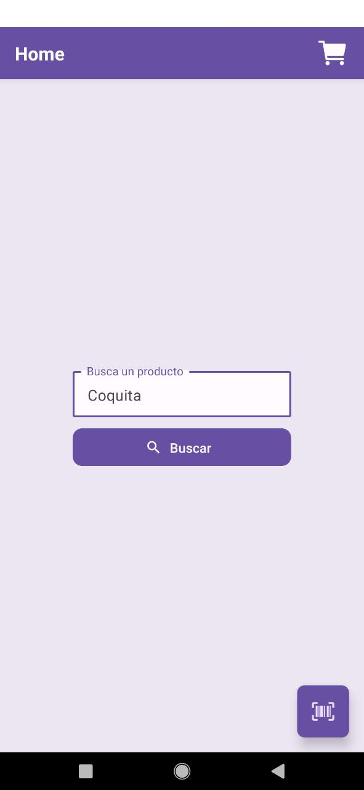
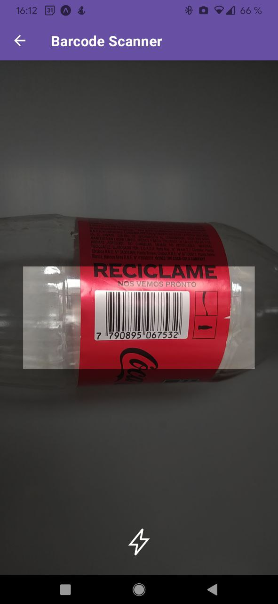
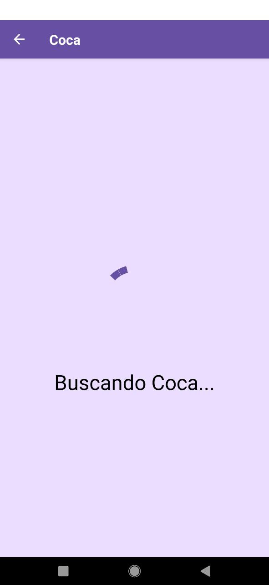
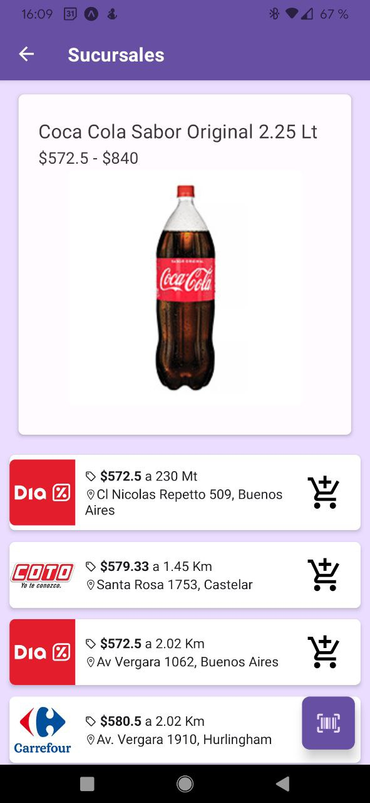
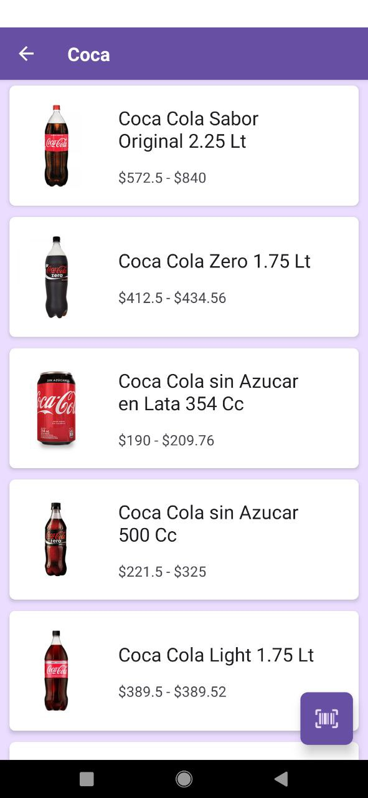
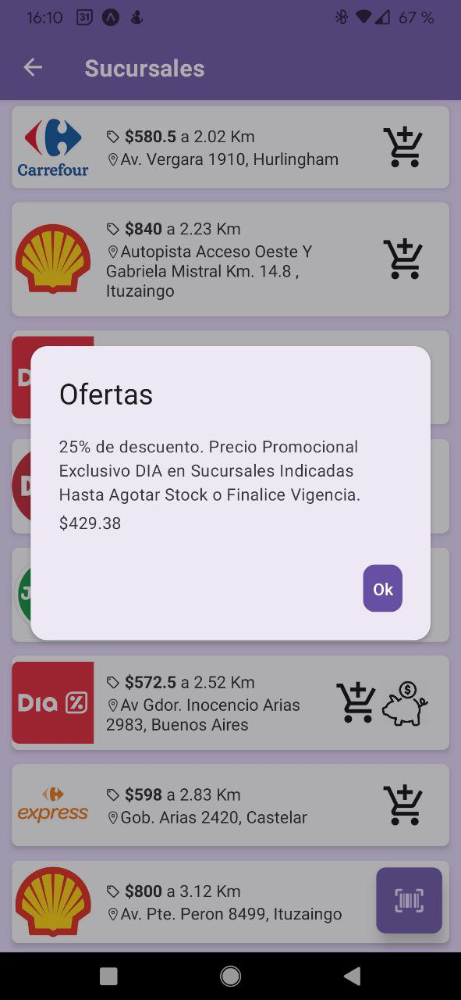

# Al Toke Precios 🚀

Al Toke Precios es una aplicación de búsqueda de precios para supermercarods argentinos. Es compatible con Android y fue escrita en React Native ⚛️.

Utiliza la API de la página web [Precios Claros](https://www.preciosclaros.gob.ar/).

> **Warning**
LA PÁGINA DE PRECIOS CLAROS SUELE ESTAR CAÍDA A LA MAÑANA. **ESTO CAUSA QUE LA APP TAMPOCO FUNCIONE**

## ✨ Características

-   Buscá productos usando palabras clave o el código de barras EAN-13.
-   Encuentra supermercados cercanos que venden el producto.
-   Muestra ofertas si están disponibles.
-   Muestra el precio mínimo y máximo de cada artículo.
-   Distancia de cada supermercado.
-   Compara el precio del producto en diferentes sucursales de los supermercados.

### Permisos

<ins>Ubicación:</ins> se requiere para encontrar supermercados cercanos.

<ins>Cámara:</ins> se solicita en caso de querer hacer una búsqueda por código de barras.

## 🖼️ Screenshots

## 👥 Contribución

Si querés contribuir a Al Toke Precios estaría buenísimo. Podés hacer lo siguiente:

-   Reportar errores o problemas en la sección de Issues.
-   Crear Pull Requests con correcciones o mejoras.
-   Proponer mejoras en la sección de Issues.

## 💡 To-Do

-   [] Mejorar UI.
-   [] Agregar animaciones.
-   [] Mejorar canasto de compras.
-   [] Generar nuevas builds automáticamente.
-   [] Agregar actualizador.

## 📄 Licencia

Al Toke Precios está bajo la Licencia GNU GPLv3.
